<div align="center">

# DistriStore

### **A LAN-Optimized, Trackerless P2P Distributed Storage Framework**

*Encrypted · Content-addressed · Swarmed · Self-healing · Zero-trust*

[](https://www.python.org/)
[](https://nodejs.org/)
[](https://fastapi.tiangolo.com/)
[](https://react.dev/)
[](LICENSE)

**Upload anywhere · Retrieve anywhere · No central server · No tracker · No trust assumptions**

</div>

---

## Table of Contents

- [1. Overview](#1-overview)
- [2. Novelty Highlights](#2-novelty-highlights)
- [3. System Architecture](#3-system-architecture)
- [4. Class Diagrams (OOPS)](#4-class-diagrams-oops)
- [5. Database — ER Diagram](#5-database--er-diagram)
- [6. Data Flow Diagrams](#6-data-flow-diagrams)
- [7. Network Protocol Stack](#7-network-protocol-stack)
- [8. Encryption Architecture](#8-encryption-architecture)
- [9. Onion Routing Protocol](#9-onion-routing-protocol)
- [10. Threshold Encryption Protocol](#10-threshold-encryption-protocol)
- [11. Proof-of-Storage Audit Protocol](#11-proof-of-storage-audit-protocol)
- [12. Reed-Solomon Erasure Coding](#12-reed-solomon-erasure-coding)
- [13. Chat & Selective Sharing](#13-chat--selective-sharing)
- [14. REST API Reference](#14-rest-api-reference)
- [15. Performance Benchmarks](#15-performance-benchmarks)
- [16. Quick Start](#16-quick-start)
- [17. Configuration](#17-configuration)
- [18. Testing](#18-testing)
- [19. Tech Stack](#19-tech-stack)
- [20. Repository Layout](#20-repository-layout)

---

## 1. Overview

**DistriStore** is a peer-to-peer storage framework designed from scratch for high-throughput LAN deployments with cryptographic privacy guarantees. Every node is a complete, self-contained participant — there is **no central server, no tracker, no DHT bootstrap node, no coordinator**. Discovery happens via authenticated UDP broadcasts; routing happens via XOR distance; replication happens via gossip; and every byte is end-to-end encrypted with authenticated AES-256-GCM.

The system goes beyond traditional P2P storage by combining **four privacy guarantees** that no other system (Dropbox, BitTorrent, IPFS, Ceph) integrates together:

1. **Trackerless discovery** — no coordinator anywhere
2. **Threshold encryption (Shamir SSS)** — even the recipient cannot decrypt without an M-of-N peer quorum
3. **Onion-routed chunk fetches** — the holder doesn't know who fetched a chunk
4. **Cryptographic proof-of-storage with peer reputation** — dishonest peers are detected and demoted

Files are split into 256 KB chunks, each one separately compressed (zstd), encrypted (AES-256-GCM), Merkle-tree-hashed, and replicated across the network via either k-copy replication or Reed-Solomon erasure coding (k=6, n=9).

---

## 2. Novelty Highlights

| # | Feature | What's novel | Why it matters |
|---|---|---|---|
| 1 | **Zero central server** | UDP HELLO + HMAC swarm key only — no coordinator at any layer | Kill any node, the rest still find each other |
| 2 | **Threshold-encrypted files** | AES key Shamir-split across N peers; M needed to reconstruct | Even sender + recipient + a holder can't decrypt unilaterally |
| 3 | **Onion-routed fetches** | Layered SealedBox per hop — relay peels one layer, sees only next hop | Holder can't tell who's fetching; intermediaries can't read the request |
| 4 | **Proof-of-storage audits** | SHA-256 challenge-response; peers must return `SHA-256(chunk‖nonce)` | Dishonest peers detected within seconds; reputation auto-demotes them |
| 5 | **Consent-gated sharing** | File shares require an accepted 1:1 chat invite first | No friend graph, no central directory; the invite IS the consent |
| 6 | **Reed-Solomon erasure** | k=6 of n=9 shards (vs 3× full replication) | Same fault tolerance, half the storage cost |
| 7 | **Recipient-gated decryption** | Threshold files refuse to decrypt for non-recipients (HTTP 403) | Cryptographic addressing — not just a UI gate |

---

## 3. System Architecture

DistriStore is structured as a **3-layer system**: a presentation layer (React + FastAPI), a trust/cryptography layer, and a P2P fabric layer. Every layer runs locally on every node.

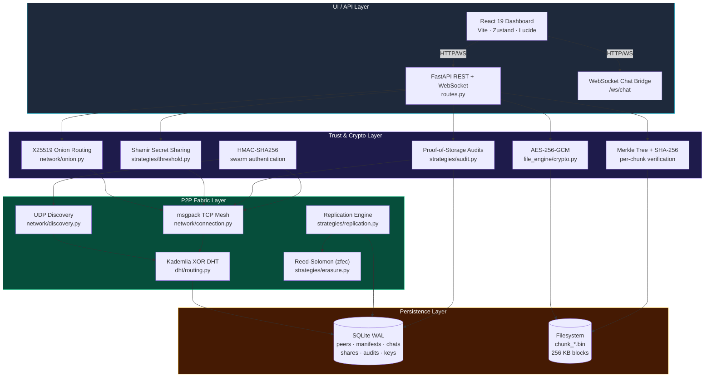

### 3.1 Why three layers?

| Layer | Concern | Failure mode | Mitigation |
|---|---|---|---|
| **UI / API** | User-facing operations, file IO | UI crash, stale data | Stateless — survives backend restart |
| **Trust & Crypto** | Confidentiality, integrity, authenticity | Wrong password, tampered chunk | Authenticated encryption rejects on decrypt |
| **P2P Fabric** | Discovery, routing, replication | Peer churn, partition | Heartbeats, re-replication, reputation |
| **Persistence** | Crash safety, fast startup | Disk full, DB corruption | WAL mode, LRU eviction, idempotent ops |

---

## 4. Class Diagrams (OOPS)

### 4.1 Node Core — the orchestrator

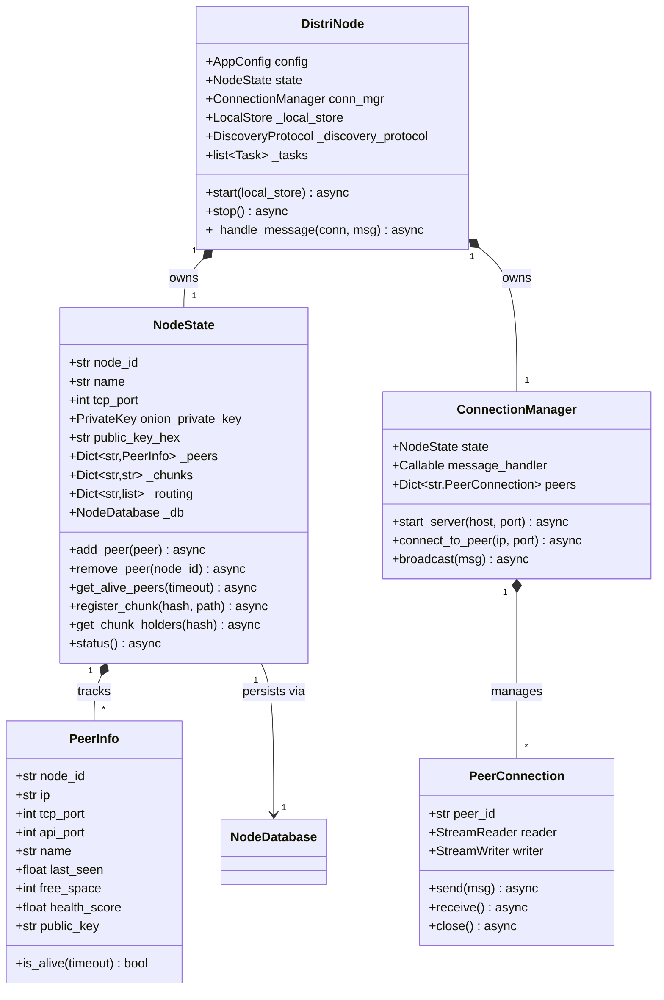

### 4.2 File Engine — chunking, encryption, manifest

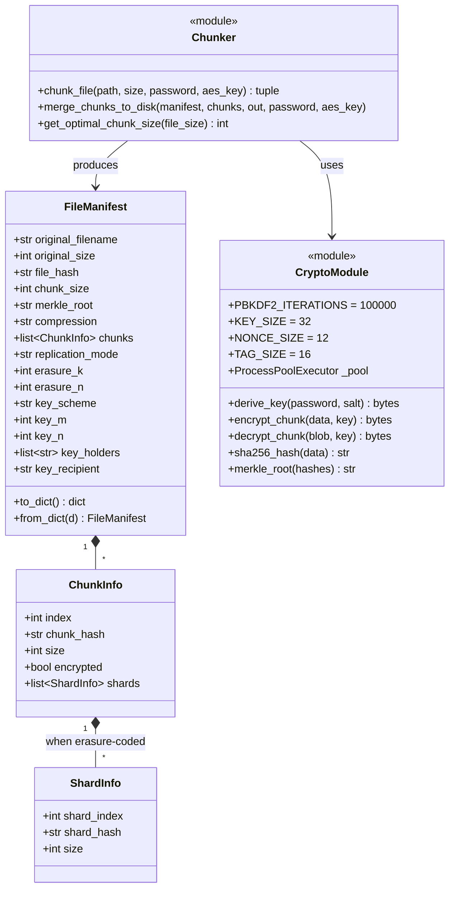

### 4.3 Storage — local disk + SQLite

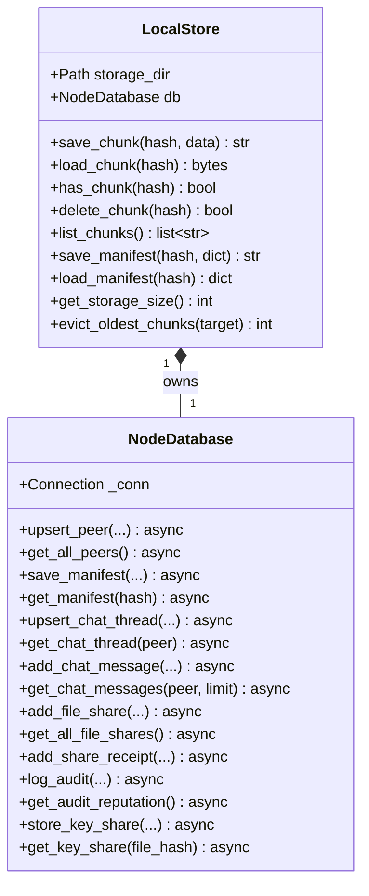

### 4.4 Strategies — replication, erasure, threshold, audit

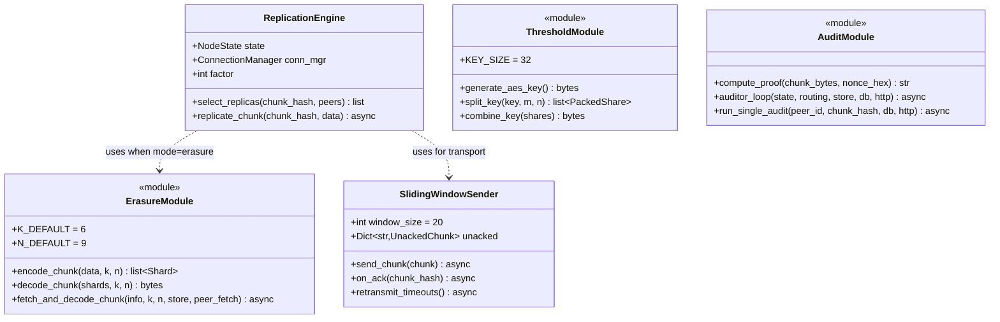

---

## 5. Database — ER Diagram

Each node persists state in a single SQLite file (`{storage_dir}/distristore.db`) running in **WAL mode** for crash safety + concurrent reads. There are **9 tables** spanning peer state, file metadata, chats, shares, audits, threshold key shares, and the node's own identity.

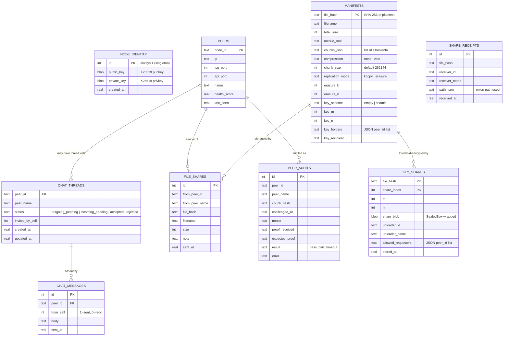

### 5.1 Why SQLite?

> **Q: doesn't SQLite mean we have a "central server"?**
>
> **A: No.** SQLite is an *embedded library* (single-file, in-process), not a server. Each node has its own private SQLite file inside its own storage directory. The network has no shared database — it has N independent SQLite files (one per node). Cross-node state is reconciled over the P2P protocol, not via a shared DB.

---

## 6. Data Flow Diagrams

### 6.1 Upload pipeline (password mode)

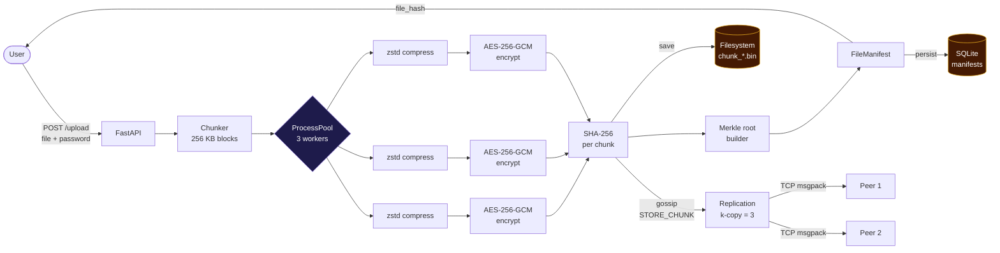

### 6.2 Download pipeline (cross-node, with onion fallback)

```mermaid
flowchart TD
    USER([User]) -->|"GET /download/&#123;hash&#125;<br/>?password=..."| API[FastAPI]
    API --> M{Manifest<br/>local?}
    M -->|Yes| LOAD[Load manifest<br/>from SQLite]
    M -->|No| ASK[Query peers via<br/>HTTP /manifest/&#123;hash&#125;]
    ASK --> CACHE[Cache locally]
    CACHE --> LOAD

    LOAD --> LOOP{For each chunk}
    LOOP -->|local hit| READ[Read chunk_*.bin]
    LOOP -->|miss| ONION[Onion fetch<br/>via random circuit]
    ONION --> R1[Relay 1<br/>peels layer 1]
    R1 --> R2[Relay 2<br/>peels layer 2]
    R2 --> HOLD[Holder<br/>returns chunk]

    READ --> DEC[ProcessPool<br/>decrypt + decompress]
    HOLD --> CACHE2[Cache locally]
    CACHE2 --> DEC

    DEC --> MV{Merkle<br/>verify}
    MV -->|fail| ERR[400 'integrity check failed']
    MV -->|ok| MERGE[Merge chunks<br/>to temp file]
    MERGE --> SERVE[FileResponse<br/>streaming download]
    SERVE --> USER

    style ONION fill:#064e3b,stroke:#34d399,color:#fff
    style MV fill:#1e1b4b,stroke:#a78bfa,color:#fff
```

### 6.3 Threshold-encrypted upload + download

```mermaid
flowchart TB
    subgraph UP ["Upload (sender = alpha, recipient = beta)"]
        SENDER([Sender]) -->|"POST /upload-threshold<br/>file + recipient + m + n"| TAPI[FastAPI]
        TAPI --> GEN[Generate random<br/>AES-256 key K]
        GEN --> ENC[Encrypt file chunks<br/>using K]
        ENC --> SPLIT[Shamir split K into<br/>n shares, any m reconstruct]
        SPLIT --> WRAP[Seal each share with<br/>holder's X25519 pubkey]
        WRAP --> DIST[Distribute to N holders<br/>via /peer/keyshare/store]
        ENC --> CHUNKS[Replicate encrypted<br/>chunks normally]
        DIST --> MAN2[Manifest:<br/>key_scheme=shamir<br/>key_holders=&#91;N peer_ids&#93;<br/>key_recipient=beta]
    end

    subgraph DL ["Download (recipient = beta)"]
        BETA([Recipient]) -->|"GET /download/&#123;hash&#125;"| BAPI[FastAPI]
        BAPI --> CHECK{key_recipient<br/>== self?}
        CHECK -->|No| F403[HTTP 403]
        CHECK -->|Yes| COLLECT[Ask each holder<br/>/peer/keyshare/release]
        COLLECT --> VAL{Holder verifies:<br/>requester in<br/>allowed_requesters?}
        VAL -->|No| F403B[HTTP 403]
        VAL -->|Yes| RELEASE[Holder unwraps share<br/>re-seals to requester]
        RELEASE --> COMBINE[Beta collects M shares<br/>combines via Shamir]
        COMBINE -->|reconstructed K| DECRYPT[Decrypt chunks<br/>with K]
        DECRYPT --> SERVE2[Stream file to beta]
    end

    style GEN fill:#1e1b4b,stroke:#a78bfa,color:#fff
    style SPLIT fill:#1e1b4b,stroke:#a78bfa,color:#fff
    style WRAP fill:#1e1b4b,stroke:#a78bfa,color:#fff
    style COMBINE fill:#1e1b4b,stroke:#a78bfa,color:#fff
```

---

## 7. Network Protocol Stack

DistriStore uses **three distinct wire protocols** that operate side by side:

| Layer | Protocol | Purpose | Encoding | Authentication |
|---|---|---|---|---|
| **Discovery** | UDP broadcast | Find peers | orjson | HMAC-SHA256 swarm key |
| **Mesh control** | TCP (length-prefixed) | Replication, chunk transfer | msgpack | HMAC-SHA256 swarm key |
| **Application** | HTTP/REST + WebSocket | UI ↔ backend, peer-to-peer ops | JSON / multipart | per-endpoint (no global) |

### 7.1 Discovery handshake

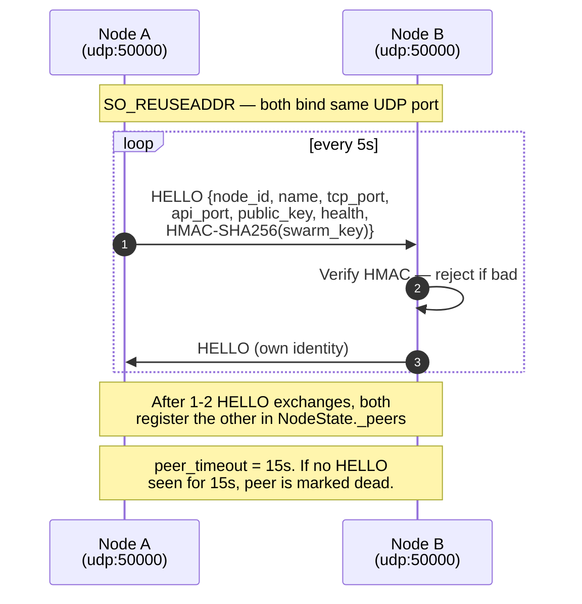

### 7.2 TCP mesh framing (msgpack)

```text
┌─────────────────┬───────────────────────────┐
│ length (4 B BE) │ msgpack(message_dict)     │
└─────────────────┴───────────────────────────┘
```

Message types:

| Type | Direction | Purpose |
|---|---|---|
| `STORE_CHUNK` | sender → holder | Replication push |
| `STORE_ACK` | holder → sender | Confirms persistence |
| `GET_CHUNK` | requester → holder | Direct chunk fetch (deprecated; onion preferred) |
| `CHUNK_DATA` | holder → requester | Chunk bytes |
| `CHAT` | any → any | Legacy swarm chat broadcast |
| `FIND_NODE` / `FIND_RESULT` | DHT lookup | XOR-distance peer search |
| `PING` / `PONG` | any → any | Liveness probe |

### 7.3 HTTP/REST as application layer

The HTTP API is used both by the UI and by peers (peer-to-peer endpoints under `/peer/...`). This avoids a separate application protocol — onion routing relays just POST to the next hop's `/relay`, and threshold key shares move via `/peer/keyshare/store|release`.

---

## 8. Encryption Architecture

### 8.1 Chunk encryption — defense in depth

```mermaid
flowchart LR
    PLAIN[Plaintext chunk<br/>up to 256 KB] --> COMPRESS[zstd level 3<br/>~2-5x reduction on text]
    COMPRESS --> KEY{Password mode?}

    KEY -->|Yes| PBKDF[PBKDF2-HMAC-SHA256<br/>100K iterations<br/>+ 16-byte salt]
    KEY -->|No: threshold| RAW[Random 32-byte<br/>AES-256 key]

    PBKDF --> AESKEY[AES-256 key]
    RAW --> AESKEY
    AESKEY --> AESGCM[AES-256-GCM<br/>+ 12-byte nonce]
    AESGCM --> CIPHER["Ciphertext + 16-byte<br/>authentication tag"]

    CIPHER --> FRAME["Wire format:<br/>&#91;version 1B&#93; &#91;salt 16B&#93;<br/>&#91;nonce 12B&#93; &#91;tag 16B&#93;<br/>&#91;ciphertext...&#93;"]
    FRAME --> SHA[SHA-256 over frame]
    SHA --> CHUNKHASH[chunk_hash<br/>= content address]

    style PBKDF fill:#1e1b4b,stroke:#a78bfa,color:#fff
    style AESGCM fill:#1e1b4b,stroke:#a78bfa,color:#fff
    style SHA fill:#064e3b,stroke:#34d399,color:#fff
```

### 8.2 Merkle tree integrity

Every file's manifest carries a **Merkle root** computed over the per-chunk SHA-256 hashes. Any chunk corruption is mathematically detectable before decryption fails — and per-chunk proofs allow the system to verify a single chunk without re-downloading the whole file.

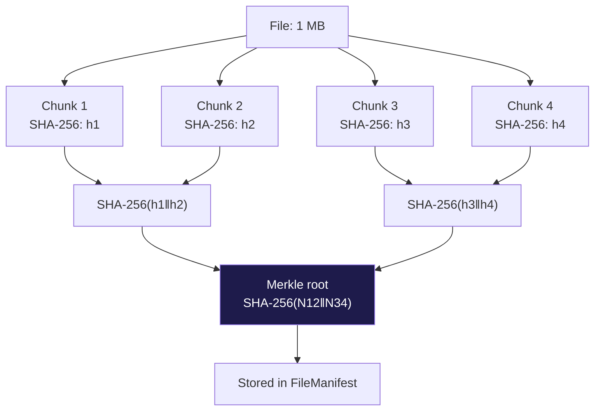

### 8.3 Key hierarchy

| Key | Origin | Lifetime | Purpose |
|---|---|---|---|
| **AES-256 file key** | PBKDF2 from password (or random for threshold) | Per-file | Encrypt all chunks |
| **X25519 node keypair** | Generated on first boot | Persistent (in `node_identity` table) | Onion routing layers + key share sealing |
| **HMAC swarm key** | Pre-shared in `config.yaml` | Static | Authenticate UDP HELLO + TCP frames |
| **Shamir shares** | Derived from AES file key | Per-file | M-of-N threshold reconstruction |

---

## 9. Onion Routing Protocol

Every cross-node chunk fetch can be routed through a multi-hop onion circuit. The requester picks a random circuit `[relay₁, relay₂, …, holder]` and wraps the request in **layered SealedBox encryption** — each layer is decryptable only by that specific hop's X25519 private key.

### 9.1 Circuit construction

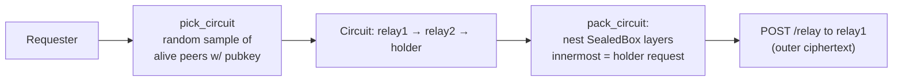

### 9.2 Layered encryption (concentric onion)

```text
                      ┌────────────────────────────────┐
                      │ SealedBox(relay1.pubkey, ...)  │  ← outer
                      │ ┌────────────────────────────┐ │
                      │ │ next_hop = relay2          │ │
                      │ │ inner = SealedBox(         │ │
                      │ │   relay2.pubkey,           │ │
                      │ │   ┌────────────────────┐   │ │
                      │ │   │ next_hop = holder  │   │ │
                      │ │   │ inner = SealedBox( │   │ │
                      │ │   │   holder.pubkey,   │   │ │
                      │ │   │   {op: fetch_chunk,│   │ │
                      │ │   │    chunk_hash: …}) │   │ │
                      │ │   └────────────────────┘   │ │
                      │ │ )                          │ │
                      │ └────────────────────────────┘ │
                      └────────────────────────────────┘
```

### 9.3 Sequence flow

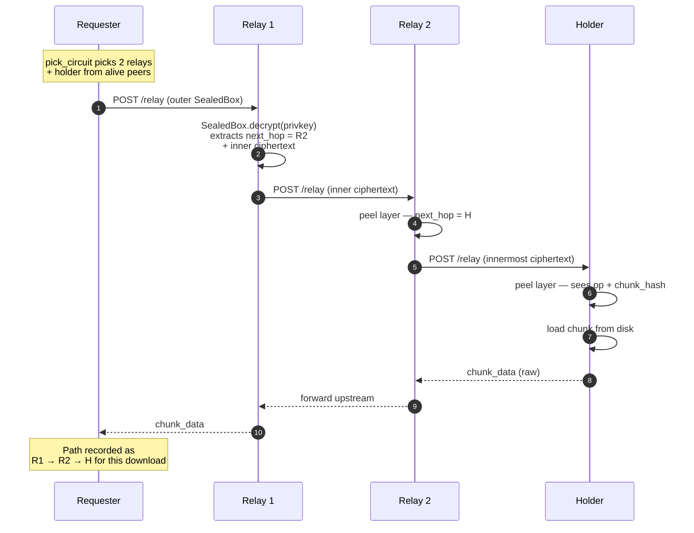

### 9.4 Privacy properties

| Observer | What they can learn | What stays secret |
|---|---|---|
| **Relay 1** | Requester's IP, that there is a request | Final destination, request body |
| **Relay 2** | Came from R1, going to H | Original requester, request body |
| **Holder** | Request body (chunk hash) | Original requester (sees R2 only) |
| **External eavesdropper** | TCP connections exist | All payloads (each layer is sealed) |

---

## 10. Threshold Encryption Protocol

The crown-jewel novelty: a file's AES-256 key is split via **Shamir Secret Sharing** across N peers. Even the recipient cannot decrypt without an M-of-N quorum cooperating.

### 10.1 Why Shamir over alternatives

| Scheme | Properties | Why not chosen |
|---|---|---|
| Single-key encryption | recipient has full key | recipient can leak unilaterally |
| Multi-recipient encryption (e.g. age) | n-of-n required | can't tolerate any holder going offline |
| Threshold encryption (Shamir) | **m-of-n quorum** | ✓ this is what we use |

### 10.2 Upload sequence

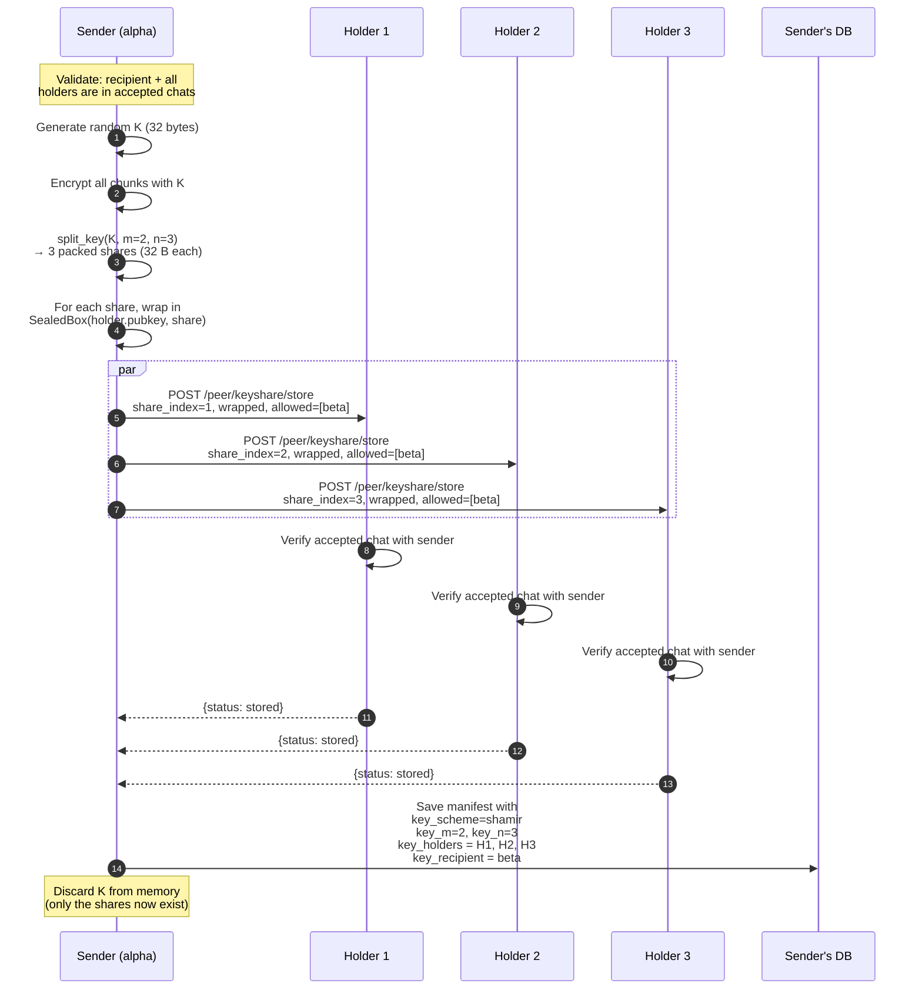

### 10.3 Download sequence (recipient side)

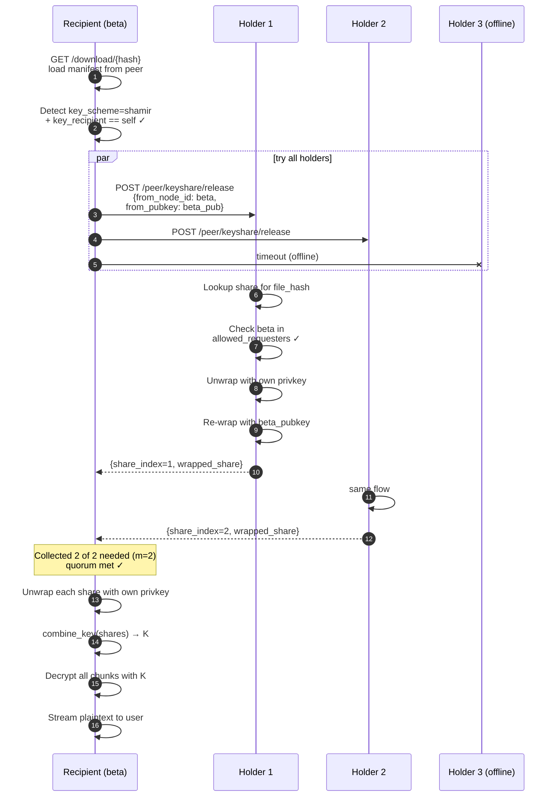

### 10.4 Probe endpoint — UI feedback

The UI calls `GET /threshold/{hash}/probe` to display real-time quorum status:

```json
{
  "is_threshold": true,
  "m": 2, "n": 3,
  "holders": [
    {"node_id": "...", "name": "node-gamma", "online": true},
    {"node_id": "...", "name": "node-delta", "online": true},
    {"node_id": "...", "name": "node-epsilon", "online": false}
  ],
  "online_count": 2,
  "decryptable_now": true,
  "recipient_id": "..."
}
```

In the UI, this drives the green "Decryptable now" / amber "Quorum not met" badges and disables the Download button when quorum isn't met.

---

## 11. Proof-of-Storage Audit Protocol

Every 30 seconds (configurable), each node runs an auditor loop that picks random peers and challenges them to prove they still hold chunks they claimed to. Failures decay reputation; persistent dishonesty causes demotion from chunk placement.

### 11.1 Challenge-response

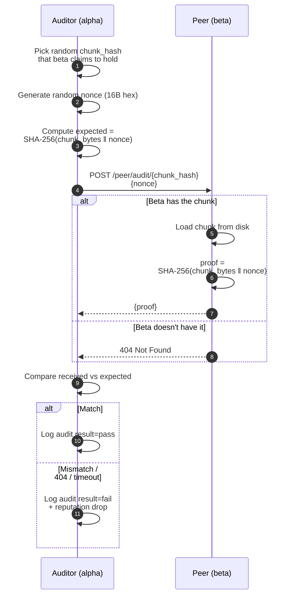

### 11.2 Reputation scoring

The reputation table is computed as a sliding-window aggregate over the last N audits:

```text
reputation_score = (passes - 2 * fails) / total_audits
```

Negative scores demote a peer in the chunk-placement selector — replication will prefer healthier peers next time around.

### 11.3 Why this is novel

Most P2P storage systems trust peers by default — if a peer says "yes I have your chunk", you believe them. DistriStore makes that claim **cryptographically falsifiable in O(1) seconds**. A peer that drops chunks (intentionally or accidentally) gets caught within one audit cycle.

---

## 12. Reed-Solomon Erasure Coding

When `replication.mode = erasure` in `config.yaml`, each chunk is split into `n=9` shards (6 data + 3 parity). Any 6 shards reconstruct the original chunk.

### 12.1 Storage cost vs fault tolerance

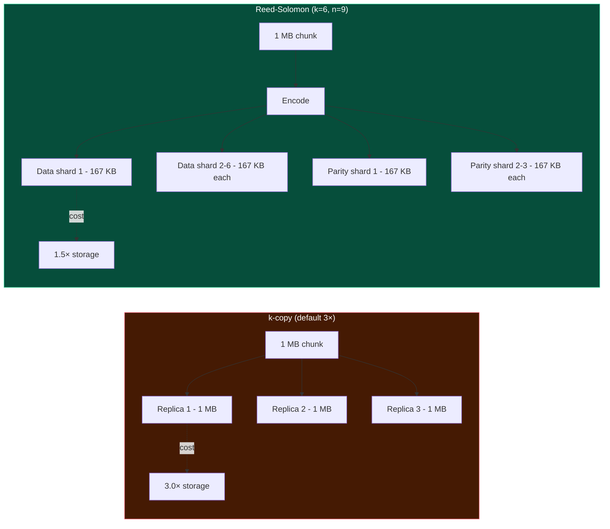

Both schemes survive **any 3 peer failures** for a chunk. RS achieves it with half the storage overhead.

### 12.2 Encoding flow

```mermaid
flowchart TB
    CHUNK[Encrypted chunk<br/>e.g. 256 KB] --> ZFEC[zfec.Encoder<br/>Vandermonde GF&#40;2⁸&#41;]
    ZFEC --> S1[Shard 1 - data]
    ZFEC --> S2[Shard 2 - data]
    ZFEC --> S3[Shard 3 - data]
    ZFEC --> S4[Shard 4 - data]
    ZFEC --> S5[Shard 5 - data]
    ZFEC --> S6[Shard 6 - data]
    ZFEC --> S7[Shard 7 - parity]
    ZFEC --> S8[Shard 8 - parity]
    ZFEC --> S9[Shard 9 - parity]

    S1 --> P1[Peer 1]
    S2 --> P2[Peer 2]
    S3 --> P3[Peer 3]
    S4 --> P4[Peer 4]
    S5 --> P5[Peer 5]
    S6 --> P6[Peer 6]
    S7 --> P7[Peer 7]
    S8 --> P8[Peer 8]
    S9 --> P9[Peer 9]
```

Decoding fetches any 6 shards in parallel via `asyncio.gather`. If a shard is unreachable, it falls through to the next candidate.

---

## 13. Chat & Selective Sharing

DistriStore implements a **consent-gated sharing model**: file shares require an accepted 1:1 chat thread first. There is no friend graph, no central directory, no contact server — the chat invite IS the consent signal.

### 13.1 Chat thread state machine

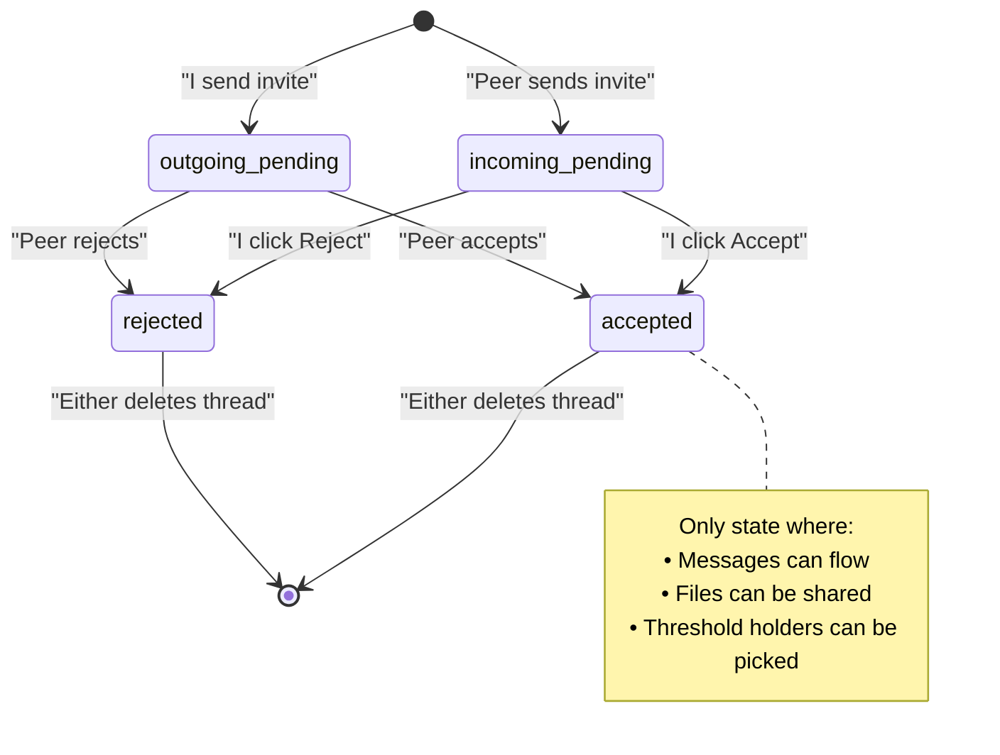

### 13.2 Race-safe upsert

When alpha invites beta and beta accepts in rapid succession, two concurrent writes hit alpha's `chat_threads` table. The `ON CONFLICT DO UPDATE` clause is structured so an `accepted` state is never overwritten by an older `outgoing_pending`:

```sql
ON CONFLICT(peer_id) DO UPDATE SET
  status = CASE
    WHEN chat_threads.status = 'accepted' AND excluded.status != 'accepted'
    THEN chat_threads.status   -- don't regress
    ELSE excluded.status
  END,
  updated_at = excluded.updated_at
```

### 13.3 Sharing flow (with onion + receipts)

```mermaid
sequenceDiagram
    autonumber
    participant A as Alpha
    participant B as Beta

    Note over A: Pre-condition: alpha and beta<br/>have an accepted chat thread
    A->>B: POST /peer/share/notify<br/>{file_hash, filename, size, note}
    B->>B: Verify accepted chat ✓<br/>Insert into file_shares table
    B-->>A: 200 OK

    Note over B: User sees share in<br/>/shared (UI inbox)

    B->>A: GET /download/{hash}<br/>(via onion route if cross-node)
    Note right of B: Path recorded as<br/>relay1 → relay2 → alpha

    B->>A: POST /shares/{id}/ack<br/>(via /peer/share/receipt)
    A->>A: Insert into share_receipts<br/>with onion path attestation
    A-->>B: 200 OK
    Note over A: Sender now sees:<br/>"beta downloaded via relay1→relay2"
```

---

## 14. REST API Reference

### 14.1 Public (UI-facing) endpoints

| Method | Path | Purpose |
|---|---|---|
| `GET` | `/status` | Node identity + peer table + storage stats |
| `GET` | `/files` | List all known files (this node + gossiped) |
| `GET` | `/files?local_only=true` | Only files held locally |
| `GET` | `/manifest/{file_hash}` | Fetch a file's manifest |
| `GET` | `/chunk/{chunk_hash}` | Raw chunk fetch (used by replication) |
| **Upload** | | |
| `POST` | `/upload` | Password-mode upload (multipart + password form field) |
| `POST` | `/upload-threshold` | Threshold mode (recipient_id, m, n, optional holder_ids) |
| **Download** | | |
| `GET` | `/download/{file_hash}?password=X` | Instant download (streamed) |
| `GET` | `/preview/{file_hash}?password=X` | Inline preview (no Content-Disposition) |
| `POST` | `/download/{file_hash}/start` | Start resumable download |
| `POST` | `/download/{file_hash}/pause` | Pause |
| `POST` | `/download/{file_hash}/resume` | Resume |
| `GET` | `/download/{file_hash}/progress` | Poll progress |
| `GET` | `/download/{file_hash}/file` | Fetch the merged file |
| `GET` | `/downloads` | List all active downloads |
| `POST` | `/downloads/clear` | Clear completed |
| `GET` | `/download/{file_hash}/path` | Onion path used for the last download |
| **Threshold** | | |
| `GET` | `/threshold/{file_hash}/probe` | Quorum status (M, N, online_count, decryptable_now) |
| **Chats** | | |
| `GET` | `/chats` | List all threads + last message |
| `POST` | `/chats/invite` | Send invite (`{peer_id}`) |
| `POST` | `/chats/{peer_id}/accept` | Accept incoming |
| `POST` | `/chats/{peer_id}/reject` | Reject incoming |
| `DELETE` | `/chats/{peer_id}` | Delete thread |
| `POST` | `/chats/{peer_id}/messages` | Send a message |
| `GET` | `/chats/{peer_id}/messages` | Fetch message history |
| **Sharing** | | |
| `POST` | `/share` | Send file refs to a peer |
| `GET` | `/shares` | Recipient inbox |
| `DELETE` | `/shares/{id}` | Remove from inbox |
| `POST` | `/shares/{id}/ack` | Send delivery receipt |
| `GET` | `/shares/{id}/path` | Onion path used (recipient view) |
| `GET` | `/share-receipts` | Sender's view of acks received |
| **Audits** | | |
| `POST` | `/audit/run` | Trigger audit on a random peer |
| `POST` | `/audit/run/{peer_id}` | Targeted audit |
| `GET` | `/audit/log` | Recent audit results |
| `GET` | `/audit/reputation` | Per-peer reputation scores |

### 14.2 Peer-to-peer endpoints (under `/peer/...`)

These are **not for end users** — they're how nodes talk to each other over HTTP.

| Method | Path | Purpose |
|---|---|---|
| `POST` | `/peer/chat/invite` | Receive an invite |
| `POST` | `/peer/chat/accept` | Receive an accept |
| `POST` | `/peer/chat/reject` | Receive a reject |
| `POST` | `/peer/chat/message` | Receive a chat message |
| `POST` | `/peer/share/notify` | Receive a share notification |
| `POST` | `/peer/share/receipt` | Receive a delivery receipt |
| `POST` | `/peer/audit/{chunk_hash}` | Respond to an audit challenge |
| `POST` | `/peer/keyshare/store` | Hold a Shamir share for a peer |
| `POST` | `/peer/keyshare/release` | Release a Shamir share to authorized requester |
| `POST` | `/relay` | Onion relay endpoint — peel one layer, forward |
| `WS` | `/ws/chat` | Legacy swarm-chat WebSocket bridge |

---

## 15. Performance Benchmarks

Numbers below are from a 3-node localhost cluster (alpha, beta, gamma) on Windows 11, Python 3.11, AES-256-GCM with `ProcessPoolExecutor` parallelism.

| Size | Upload (α) | Download local (α) | Download cross-node (β) | Round-trip |
|---|---|---|---|---|
| 1 MB | 15.3 MB/s | 15.6 MB/s | 4.8 MB/s | 130 ms |
| 10 MB | 45.8 MB/s | 38.0 MB/s | 24.9 MB/s | 481 ms |
| **50 MB** | **84.3 MB/s** | **108.1 MB/s** | **82.9 MB/s** | **1.06 s** |

- **Upload includes:** read → 256 KB chunking → AES-256-GCM encrypt → zstd compress → SHA-256 manifest → SQLite persist → background replication gossip
- **Random data:** zstd is ~1.0× (no win); reflects worst-case throughput. Compressible data gets ~2-5× better.
- **Throughput rises with size** as fixed costs (SQLite write, manifest serialization, ProcessPool warm-up) amortize.

Run the benchmark yourself: `python -m tests.benchmark_throughput`

---

## 16. Quick Start

> **Prerequisites:** Python 3.11+ · Node.js 22+

```bash
# Linux / macOS
./setup.sh    # venv + Python deps + npm install
./start.sh    # backend + frontend

# Windows
setup.bat
start.bat
```

### Multi-node testing (3+ peers on the same machine)

```bash
# Terminal 1 — alpha
DS_NAME=node-alpha DS_API_PORT=8888 DS_TCP_PORT=50001 python -m backend.main

# Terminal 2 — beta
DS_NAME=node-beta DS_API_PORT=8889 DS_TCP_PORT=50002 DS_STORAGE_DIR=.storage_beta python -m backend.main

# Terminal 3 — gamma
DS_NAME=node-gamma DS_API_PORT=8890 DS_TCP_PORT=50003 DS_STORAGE_DIR=.storage_gamma python -m backend.main

# Frontend (in another terminal)
cd frontend && npm run dev -- --host
```

UDP discovery uses `SO_REUSEADDR` so all three nodes share port `50000` without conflict. Peers find each other within ~5 seconds.

---

## 17. Configuration

Edit `config.yaml`:

```yaml
node:
  node_id: "auto"           # or 40-char hex
  name: "node-alpha"

network:
  discovery_port: 50000
  tcp_port: 50001
  broadcast_address: "255.255.255.255"
  discovery_interval: 5     # HELLO interval (s)
  peer_timeout: 15          # mark dead after (s)
  swarm_key: "secret"       # HMAC pre-shared key

storage:
  chunk_dir: ".storage"
  chunk_size: 262144        # 256 KB default
  max_storage_mb: 5120      # LRU eviction beyond this

replication:
  mode: "kcopy"             # kcopy | erasure
  factor: 3                 # for kcopy
  erasure_k: 6              # for erasure
  erasure_n: 9

api:
  host: "0.0.0.0"
  port: 8888

logging:
  level: "DEBUG"
  file: "distristore.log"
```

**Environment overrides:** `DS_NAME` · `DS_API_PORT` · `DS_TCP_PORT` · `DS_UDP_PORT` · `DS_STORAGE_DIR` (precedence: env > yaml).

---

## 18. Testing

| Test | Command | Purpose |
|---|---|---|
| Comprehensive smoke test | `python -m tests.smoke_full` | 39 assertions across every endpoint |
| Master E2E | `python -m tests.test_e2e_master` | 2-node Phase 1-22 integration |
| Phase 23 erasure | `python -m tests.test_phase23_erasure` | Reed-Solomon encode/decode |
| Throughput benchmark | `python -m tests.benchmark_throughput` | MB/s across sizes |

The smoke test exercises (with a live cluster running):

1. Status / discovery / files / manifest / chunk
2. Upload (password) + cross-node download
3. Resumable download (start / progress / pause / resume / file / clear)
4. Chats (invite → accept → send → list → messages)
5. Sharing (send → list → download → path → ack → receipts → delete)
6. Audits (random / targeted / log / reputation)
7. Threshold (upload → probe → recipient download → recipient gate 403)

---

## 19. Tech Stack

### Backend

| Component | Library | Why |
|---|---|---|
| Web framework | FastAPI + uvicorn | Async-native, OpenAPI, Pydantic types |
| Crypto | PyCryptodome (AES) + PyNaCl (X25519/SealedBox) | Battle-tested, fast |
| Erasure coding | zfec | Tahoe-LAFS proven |
| Compression | zstandard (zstd) | Faster + better than gzip |
| Wire protocol | msgpack + orjson | ~33% smaller than JSON |
| Persistence | SQLite (WAL) | Embedded, crash-safe, zero ops |
| Process | ProcessPoolExecutor | GIL bypass for CPU-bound crypto |
| HTTP client | httpx (async) | Native asyncio |

### Frontend

| Component | Library | Why |
|---|---|---|
| UI framework | React 19 + Vite 7 | Modern, fast HMR |
| State | Zustand | Lightweight, no provider hell |
| Icons | Lucide React | Tree-shakeable, consistent |
| HTTP | Axios | Familiar, interceptor support |
| Routing | React Router v7 | Standard |
| Styling | Hand-written CSS variables | Pastel light theme, no framework bloat |

---

## 20. Repository Layout

```
distristore/
├── backend/
│   ├── main.py                       FastAPI entry + lifespan
│   ├── api/
│   │   ├── routes.py                 REST + WS endpoints
│   │   └── download_manager.py       Resumable download state machine
│   ├── node/
│   │   ├── node.py                   DistriNode orchestrator
│   │   └── state.py                  NodeState + PeerInfo (asyncio locks)
│   ├── network/
│   │   ├── discovery.py              UDP HELLO + HMAC + health scoring
│   │   ├── connection.py             TCP mesh + msgpack framing
│   │   ├── protocol.py               Message schemas
│   │   ├── identity.py               X25519 keypair persistence
│   │   └── onion.py                  Circuit picker + layered SealedBox
│   ├── dht/
│   │   ├── routing.py                XOR distance + chunk → peer table
│   │   └── lookup.py                 FIND_NODE / FIND_RESULT
│   ├── file_engine/
│   │   ├── crypto.py                 AES-256-GCM + PBKDF2 + ProcessPool
│   │   ├── chunker.py                FileManifest + ChunkInfo + ShardInfo
│   │   └── pipeline.py               Streaming chunk pipeline
│   ├── strategies/
│   │   ├── replication.py            k-copy peer selector
│   │   ├── erasure.py                Reed-Solomon (zfec) encode/decode
│   │   ├── threshold.py              Shamir SSS split/combine
│   │   ├── audit.py                  Proof-of-storage challenge loop
│   │   ├── sliding_window.py         Reliable transport layer
│   │   └── selector.py               Health-scored peer ranking
│   ├── storage/
│   │   ├── local_store.py            Chunk file IO
│   │   └── db.py                     SQLite (9 tables) — see ER diagram
│   ├── advanced/
│   │   ├── heartbeat.py              Liveness monitoring
│   │   ├── self_healing.py           Re-replication on peer death
│   │   └── garbage_collector.py      Orphan chunk cleanup
│   └── utils/
│       ├── config.py                 YAML + env overrides
│       └── logger.py                 Structured logging
│
├── frontend/
│   └── src/
│       ├── App.jsx                   Router + layout shell
│       ├── pages/
│       │   ├── DashboardPage.jsx     Status, peers, files
│       │   ├── UploadPage.jsx        Password + threshold modes
│       │   ├── DownloadPage.jsx      Instant + resumable + preview
│       │   ├── ChatsPage.jsx         1:1 invite-based chats
│       │   ├── SharedWithMePage.jsx  Inbox + threshold probe
│       │   ├── AuditsPage.jsx        Reputation + log
│       │   └── SettingsPage.jsx      Read-only config display
│       ├── components/
│       │   ├── layout/  (Header, Sidebar)
│       │   ├── ui/      (Card, Button, RoutePath, ShareModal, …)
│       │   └── network/ (PeerTable, NetworkTopology, ActiveDownloads, …)
│       ├── store/useNetworkStore.js  Zustand global store
│       ├── api/client.js             Axios singleton
│       └── index.css                 Pastel theme tokens
│
├── tests/
│   ├── smoke_full.py                 Comprehensive endpoint smoke test
│   ├── benchmark_throughput.py       Upload/download MB/s
│   ├── test_e2e_master.py            Phase 1-22 master E2E
│   └── test_phase*.py                Per-phase unit tests
│
├── tools/
│   └── generate_ppt.py               Pitch deck generator (python-pptx)
│
├── config.yaml                       Single source of truth
├── requirements.txt                  Python deps
├── package.json                      Node deps
├── start.bat / start.sh              One-command boot
├── setup.bat / setup.sh              Install deps
├── DistriStore_Pitch.pptx            Modern pitch deck
└── README.md                         You are here
```

---

<div align="center">

**DistriStore** — Trackerless. Encrypted. Recipient-gated.

*Computer Networks Project · IIIT Allahabad*

</div>
